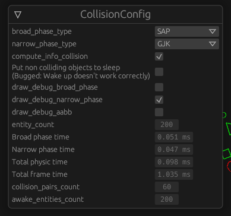

# Rusted physics

You can launch the target by either

- running `cargo run --release` [(Needs to have Rust toolchain installed)](https://www.rust-lang.org/tools/install)
- Running the binary in milestones/{milestone_name}/BIN folder

These two process might give different results depending on which commit you are on.
If you are on the right tag it will be identical, but not if you are on other commits.

# How to use

Move Camera: WASD or Drag mouse while clicking on Middle mouse button

Zoom Camera: Mouse wheel scroll

Move Polygon: Left Click + Drag polygon

Rotate Polygon: Right Click + Drag polygon

Add 100 polygon: Z

Spam Add 100 polygon: X

Clear Scene: F1
Jiggle every polygon: E

# How to read

- broad_phase_type: Allows to select the type of broad phase (Or disabled)
- narrow_phase_type: Allows to select the type of narrow phase (Or disabled)
- draw_debug_broad_phase: If on, draw a yellow line between polygons which pass the broadphase check
- draw_debug_narrow_phase: If on, draw a purple line between the polygons that collide
- draw_debug_aabb: Draw the polygon's AABB

The remaining data are read-only self-explanatory

# What to find in code

`collision plugin` contains all the code related to the broad_phase and narrow_phase.
They are contained in a plugin, which is added to the app in `main.rs`

# Resources

In case you need documentaion for the engine :
 - [Getting Started](https://bevyengine.org/learn/book/getting-started/)
 - [Bevy doc](https://docs.rs/bevy/latest/bevy/)
 - [Bevy cheatbook](https://bevy-cheatbook.github.io/introduction.html)
 - [Rust by example](https://doc.rust-lang.org/rust-by-example/)
 - [Rust doc](https://doc.rust-lang.org/std/)